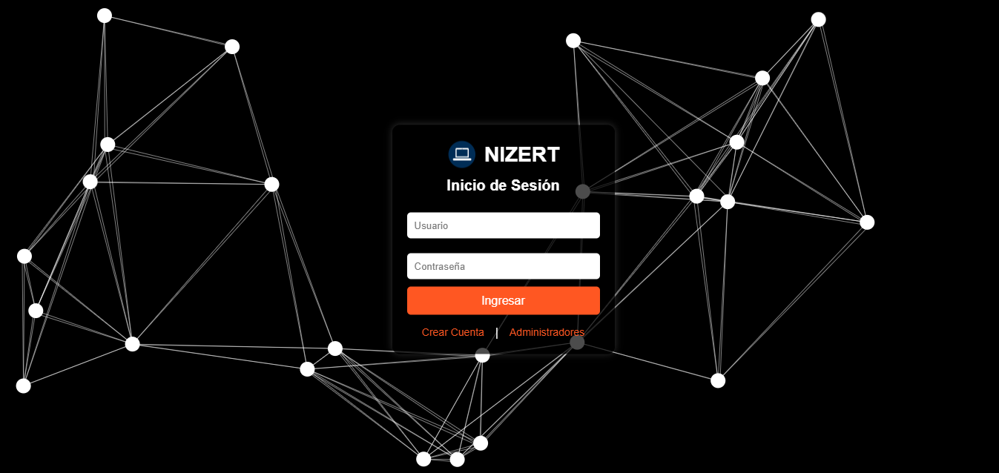

# 🌌 NIZERT – Inicio de Sesión con Fondo Interactivo

Una interfaz moderna de inicio de sesión con un fondo animado interactivo, creada con HTML, CSS y JavaScript.

## ✨ Características

- 🎨 Fondo dinámico con animación de partículas conectadas (Canvas + JS)
- 🖥️ Diseño centrado, limpio y responsive
- 🔒 Formulario de login con campos de usuario y contraseña
- 🧊 Estilo en escala de grises con acento naranja
- 📦 Estructura modular con archivos separados

## 🛠️ Tecnologías Usadas

- HTML5
- CSS3
- JavaScript (Canvas API)

## 📁 Estructura del Proyecto

├── index.html # Página principal con el formulario 
├── style.css # Estilos del login y fondo 
├── bola.js # Clase Bola para las partículas
├── script.js # Animación e interacción con el canvas 
├── prueba.png # Logo mostrado en la interfaz

## 🧪 Vista previa

> *Reemplaza la ruta anterior con una imagen subida a GitHub o GitHub Pages.*

## 🚀 Cómo verlo en vivo

https://pruebadeparticulas.netlify.app

2. Abre `index.html` en tu navegador.

## 📬 Contacto

Puedes escribirme o ver más de mis proyectos aquí:

- GitHub: [@tuusuario](https://github.com/tuusuario)
- Portafolio: [Tu sitio si ya lo tienes online]

---

### ✨ Hecho con pasión por Diego 😎

